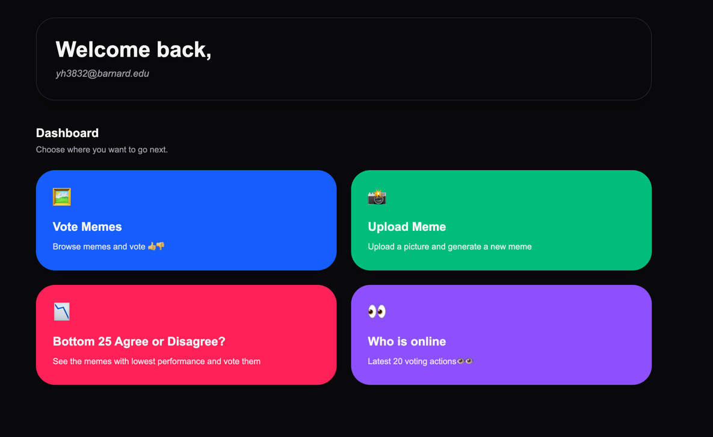
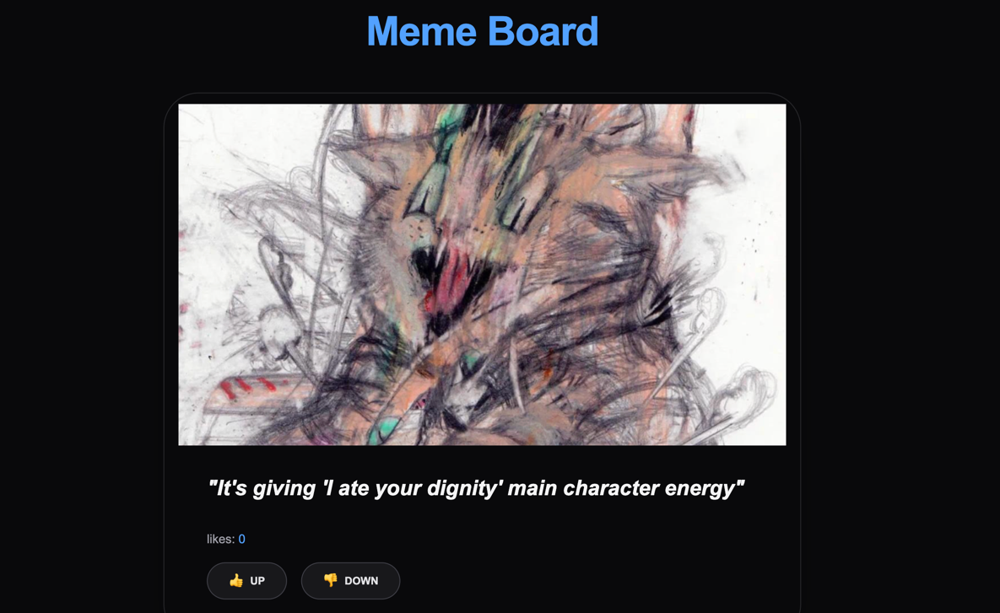
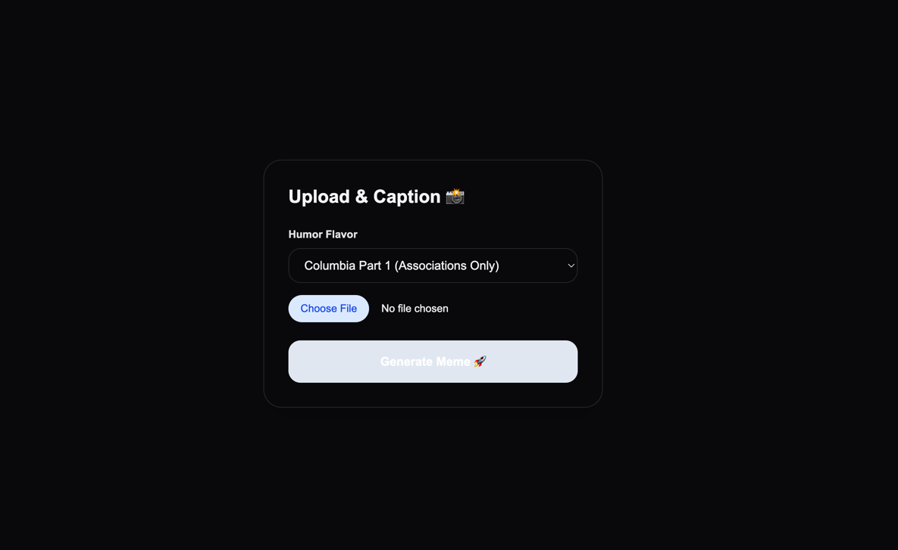
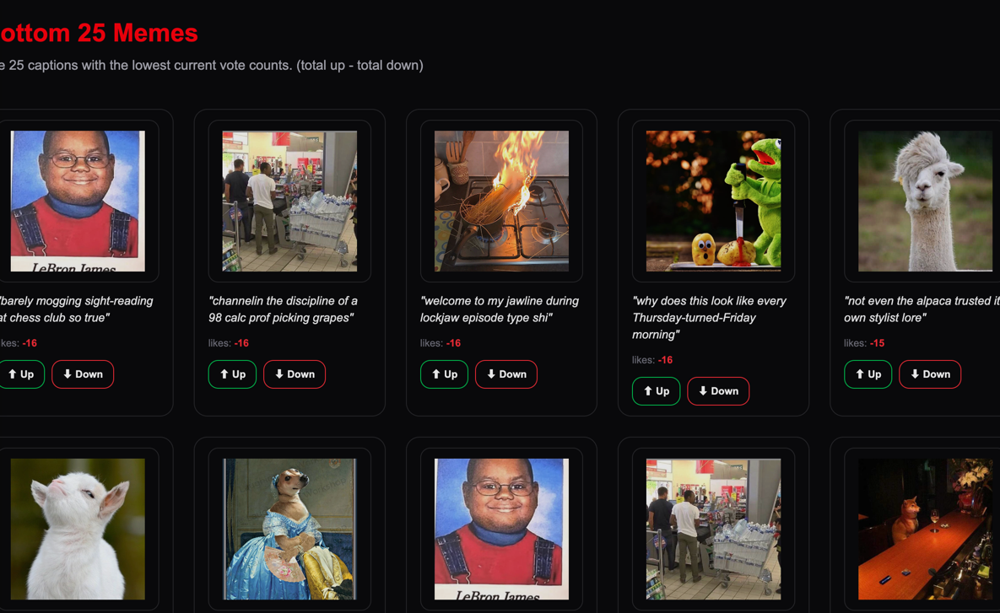
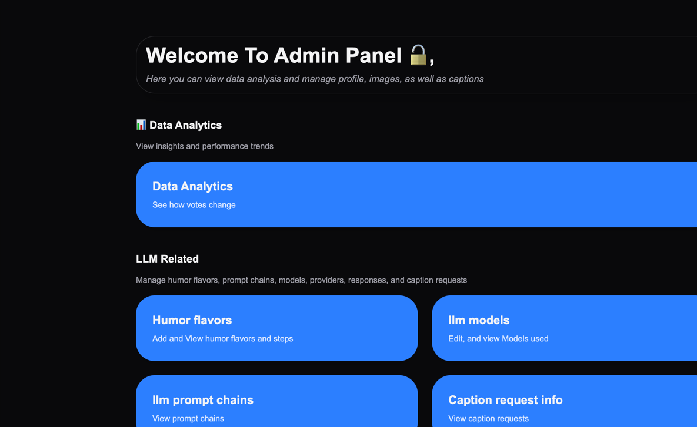
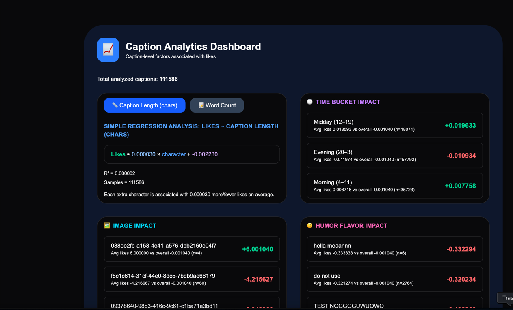

### Web access: https://project2-tau-eight.vercel.app

### TODOs:
- Letting regular users download memes

# MemeLab

A full-stack meme creation and voting platform built with **Next.js 16**, **Supabase**, and **TypeScript**. Users can browse memes, vote on them, generate AI-powered captions, and explore engagement analytics.

## Overview

MemeLab combines a social meme voting feed with an AI caption generation studio. Users pick an image, choose a humor personality ("flavor"), and get 5 AI-generated captions to choose from. Admins get a full analytics dashboard to understand what makes captions perform well.

## LLM Usage

This project used three LLM tools during development:

- **Gemini** — helped generate the rough initial project structure
- **ChatGPT** — assisted with UI suggestions and frontend iteration
- **Grok** — helped optimize parts of the computation logic
- **Claude** — used for ongoing feature development, bug fixes, and refactoring throughout the project

These tools were used as development aids, while the final design, integration, debugging, and feature decisions were implemented and refined within the project workflow.

## Features

### User-Facing

#### 1. Home Page (`/`)
- Publicly accessible — no login required to view
- Clicking any feature button while logged out shows an "Log in before you can do this" prompt
- Quick-launch cards for Meme Board and Meme Lab, with live top-meme background image on the Meme Board card
- Logged-in users see their email; guests see a "Log in" button
- Superadmin users see their Humor Flavor collection

#### 2. Meme Board (`/main`)
- Scrollable meme voting feed with **pile** and **grid** view modes (toggle in sidebar)
- **Pile mode**: card-by-card browsing with slide-out animations; voted memes move to the end of the pile
- **Grid mode**: all memes laid out at once; click a card to expand it inline and vote (👍 / 👎 / ✨ make similar)
- Vote up or down; unvote by clicking again
- "Make Similar" (✨) pre-fills Meme Lab with the same image + caption for remixing
- Search bar to filter captions by text
- Pile selector: All / Liked / Disliked

#### 3. Meme Lab (`/upload`)
- **Gallery mode**: pick from the top 50 highest-rated images
- **Upload mode**: drag-and-drop or click to upload your own image
- Choose a humor flavor (AI personality) from a searchable dropdown
- Generates **5 AI captions at once** — displayed as a numbered list to pick from
- Click any caption to select it; edit it freely before publishing
- "Generate 5 New Captions" calls the AI again with the current flavor for a fresh batch
- Generated captions are kept as hidden drafts until you explicitly click "Add to Meme Board"
- **My Memes sidebar**: view all your published memes; click to preview, click × to delete

#### 4. Least Favored (`/least-favored`)
- Displays the bottom 25 memes by score

#### 5. Who Is Online (`/list`) *(admin only)*
- Recent voting activity feed

#### 6. Authentication
- Google OAuth login via Supabase (`/login`)
- Sidebar hides logout button for unauthenticated guests
- Session expiry automatically redirects to login

---

### Admin Panel (`/admin`)

Access via sidebar for superadmin / matrix admin users.

#### Analytics (`/admin/analytics`)
- **Overview** (`/admin/analytics`): live platform stats displayed as proportionally-sized animated bubbles (total captions, images, users, flavors, votes); votes bubble contains an embedded upvote/downvote pie chart; 30-day activity line chart tracking daily captions, votes, new users, new images, and new flavors; stat bubbles update in real-time via Supabase Postgres subscriptions
- **Factors Impacting Scores** (`/admin/analytics/factors`): simple linear regression of caption length (chars or word count) vs. likes with slope, intercept, and R²; time-of-day impact (Morning / Midday / Evening UTC); flavor usage table (top 20 by caption count with avg likes bar); leaderboards for top profiles, images, humor flavors, and captions — sortable by avg likes or total likes
- **Flavor Intelligence** (`/admin/analytics/flavor`): step-count vs. performance analysis; word frequency comparison between top and bottom flavors; "Anticipated Best Mix" card with predicted optimal step count and expected likes; per-flavor outcome estimator with confidence rating (high / medium / low) based on sample size

#### LLM Related
- **Humor Flavors** (`/admin/humor-flavors`): manage AI personality options used during caption generation
- **LLM Models** (`/admin/llm_models`): manage model configurations
- **Prompt Chains** (`/admin/llm_prompt_chain`): view and edit the multi-step prompt pipelines
- **LLM Providers** (`/admin/llm_providers`): manage AI provider settings
- **LLM Responses** (`/admin/llm_responses`): inspect raw model outputs
- **Caption Requests** (`/admin/caption_requests`): view generation request logs

#### Materials
- **Images** (`/admin/images`): manage the image library
- **Caption Examples** (`/admin/caption_examples`): manage few-shot examples used in prompts
- **Meme Captions** (`/admin/captions`): browse and manage all captions
- **Terms** (`/admin/term`): manage glossary / term definitions

#### User Related
- **User Profiles** (`/admin/users`): view and manage user accounts
- **Sign Up Domains** (`/admin/sign_up_domains`): restrict which email domains can register
- **Whitelist Emails** (`/admin/whitelist_emails`): allow specific emails outside permitted domains

---

## Tech Stack

- **Frontend**: Next.js 16 (App Router), React, Tailwind CSS
- **Backend / Database**: Supabase (Postgres + Auth + Storage)
- **Language**: TypeScript
- **AI API**: `api.almostcrackd.ai` — image description (Gemini 2.5 Flash) + caption generation (GPT-4.1), returns 5 captions per request
- **Deployment**: Vercel

## AI Caption Generation Flow

1. Get a presigned S3 URL from the AI API
2. Upload the image directly to S3
3. Register the CDN URL with the AI API → receive an `imageId`
4. Call the caption generation endpoint with `imageId` + `humorFlavorId`
5. API runs a 2-step prompt chain: image description → 5 captions
6. All 5 captions are shown to the user to pick from
7. Auto-saved drafts are immediately hidden server-side (service role bypasses RLS)
8. User picks, optionally edits, and clicks "Add to Meme Board" to publish

## Real-World Data Challenges Solved

### 1. Supabase Pagination Limit
Supabase queries return at most 1000 rows by default. A custom pagination helper (`fetchAllRows`) retrieves the full dataset for analytics.

### 2. One-to-Many Join Explosion
Joining captions with LLM response tables inflated the dataset to ~110k rows. This was addressed by limiting joined variables and filtering invalid regression inputs.

### 3. Missing or Unknown Labels
Some foreign key relationships were incomplete. Fallback labels keep the dashboard readable:
```ts
profileNameById.get(id) ?? `User ${id.slice(0, 8)}`
```

### 4. Supabase RLS on Auto-Saved Records
The external AI API saves captions via service role with `is_public: true`. Client-side updates to hide them were blocked by Row Level Security. Fixed by routing the hide operation through a server-side API route (`/api/hide-draft-captions`) that uses the service role key.

### 5. Rotating Refresh Tokens
Multiple `createBrowserClient` instances competed for token refreshes, causing "Invalid Refresh Token" crashes. Fixed by memoizing the Supabase client with `useMemo`.

## Project Structure

```
app/
├── page.tsx               # Home page
├── main/                  # Meme Board (voting feed)
├── upload/                # Meme Lab (AI caption generation)
├── least-favored/         # Bottom 25 memes
├── list/                  # Activity feed (admin only)
├── login/                 # Google OAuth login
├── auth/callback/         # OAuth callback handler
├── admin/                 # Admin panel
│   ├── analytics/         # Analytics dashboard
│   ├── humor-flavors/     # Flavor management
│   ├── images/            # Image library
│   ├── captions/          # Caption management
│   ├── users/             # User profiles
│   └── ...                # Other admin pages
├── api/
│   ├── analytics/         # Analytics computation (regression, factors)
│   ├── hide-draft-captions/  # Server-side draft hiding (service role)
│   ├── top-images/        # Top-rated images for gallery
│   ├── user-center/       # User memes, votes, flavors
│   └── ...
└── components/
    └── Sidebar.tsx        # Collapsible nav sidebar
```

## Demo

Home page (guest view with Log in prompt):

Meme Board — pile mode voting:

Meme Lab — 5-caption picker:

25 memes with lowest score:

Admin panel:

Analytics dashboard:

